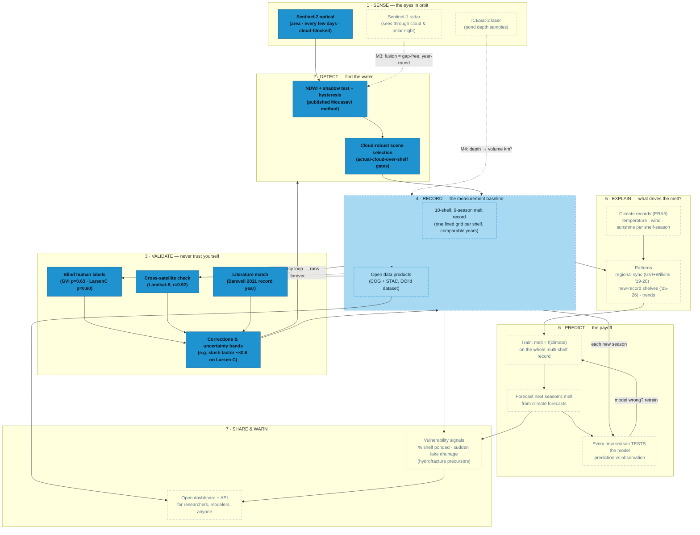

# How the Observatory Works — the full loop

From satellite photons to future predictions. **Solid boxes are built & validated;
dashed are in progress; dotted are the roadmap.** The two loops are the point:
validation never stops improving accuracy, and every new season tests the
prediction model against reality.

## Where your understanding was spot-on — and the three missing pieces

**You said:** *measure melt → find patterns across shelves → push accuracy up → train a model to predict.* Correct spine.

**Missing piece 1 — weather comes in late.** The satellites don't tell us weather;
they show the water. The climate data (ERA5: temperature, wind, sunshine) joins at
stage 5, where we ask *"what conditions produced the melt we measured?"* That
pairing is the training data for prediction.

**Missing piece 2 — accuracy is a loop, not a gate.** Validation (stage 3) never
finishes. Today's example: blind-labeling Larsen C revealed its "water" is ~40%
slush, so east-side shelves get a correction band. Every such finding flows back
into the detector and the records. The system gets more trustworthy every cycle.

**Missing piece 3 — predictions get graded.** A model that forecasts next summer's
melt is only science if next summer *tests* it (stage 6's feedback arrow). The
observatory keeps observing, so every season is a fresh exam — bad models get
retrained, good ones earn trust.

**Current position:** stages 1–4 built and validated for optical; stage 4's data
products started today (M1). Stage 5 (ERA5) is the next big science step; 6 and 7
stand on everything before them.
